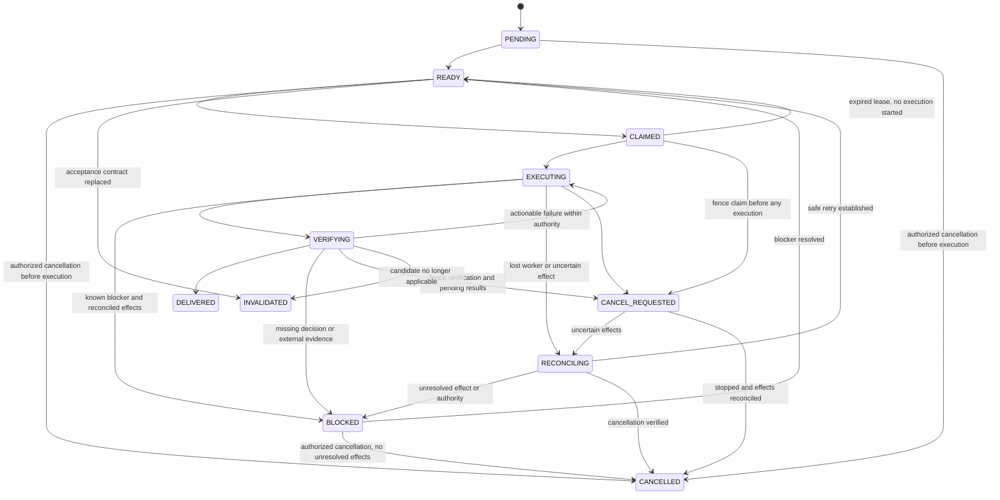

<!-- SPDX-FileCopyrightText: 2026 Libre AI contributors -->
<!-- SPDX-License-Identifier: CC-BY-4.0 -->

# Libre-AI Forge — Execution Runtime

## Objective

Make natural:

```text
act → observe → evaluate → converge
```

and structurally difficult:

```text
read → analyze → re-plan → summarize → no delivery
```

There is no generic `ANALYZING` runtime state.

## Core entities

- GoalContract
- Mission
- TaskContract
- Attempt
- ExecutionCapsule
- WorkingSet
- KnownUnknown
- ConvergenceContract
- Change
- ImpactSet
- Artifact
- Evidence
- Eval
- Finding
- Blocker
- Decision
- Lease
- Checkpoint
- AttentionItem
- CommitmentPoint

## KnownUnknown behavior

The runtime does not permit:
```text
"need more understanding"
```

without:
- exact question ;
- affected decision/task ;
- resolution mechanism.

## Convergence behavior

Forge continuously tracks:
- blocking findings ;
- repeated findings ;
- scope growth ;
- unknown count ;
- actions since candidate ;
- retry density ;
- repair loop count.

Violation actions:
1. deduplicate ;
2. defer non-blocking findings ;
3. force experiment ;
4. create Decision ;
5. block/replan impacted subgraph.

## ExecutionProtocol boundary

Forge never calls executor-specific behavior directly.

Stable interface:
```text
prepare(capsule)
execute()
observe()
checkpoint()
cancel()
resume(checkpoint)
finalize()
```

## RepositoryManifest priority

Task preparation consumes RepositoryManifest before heuristic exploration.

Fallback discovery only for:
- missing manifest ;
- stale manifest ;
- explicit verification.

## Policy vs enforcement

Policy decides:
> allowed?

Authority enforcement decides:
> executable by this actor, here and now?

A positive policy result cannot directly perform an action.

## Evidence constraint

Evidence references canonical data but does not absorb it.

## Task state machine — design candidate



`BLOCKED` is resumable, not terminal. Task terminal states are `DELIVERED`, `CANCELLED` and `INVALIDATED`. Attempt failure and task failure remain separate. A lease expiry is not permission to replay effects or grant a new worker additional rights.

A task is `DELIVERED` only after its own acceptance contract passes. Integration, artifact distribution and verified user availability are separate change/release states. A task's delivery does not prove the mission or product is delivered.

Pending cancellation must fence the old attempt and reconcile externally observable effects. Compatible checkpoint state, current authority and effect-specific retry semantics are verified before resuming. Unsupported continuation is refused or escalated, never emulated by blindly replaying a conversation.

Cancellation is an authorized, serialized transition against the current task version and attempt generation. A cancellation intent also persists while `RECONCILING`; resolving an uncertain effect must not requeue a cancelled task. Once cancellation wins, execution and verification callbacks from the fenced generation are recorded as late evidence and cannot move the task to `DELIVERED` or start another effect. If delivery already committed first, cancellation does not rewrite that terminal outcome; any compensation is a separate authorized operation.
